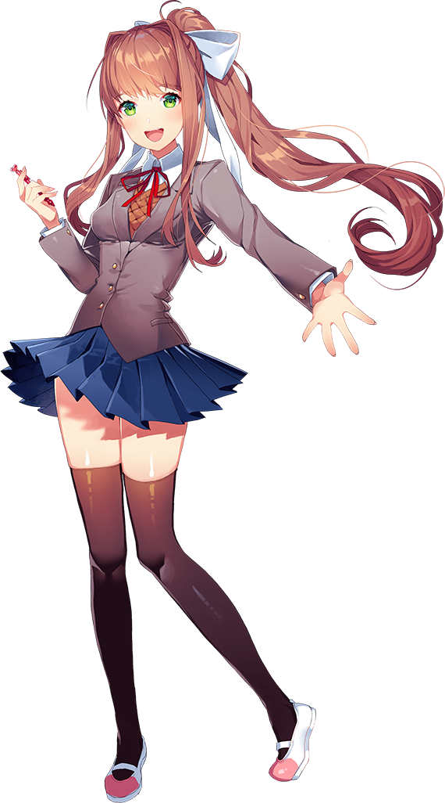

<!DOCTYPE html PUBLIC "-//W3C//DTD XHTML 1.0 Transitional//EN" "http://www.w3.org/TR/xhtml1/DTD/xhtml1-transitional.dtd">
<html xmlns="http://www.w3.org/1999/xhtml">
<head>
<link rel="icon" href="images/favicon.png">
<meta charset="utf-8">
<title>Doki Doki Popup</title>
<link href="Doki Doki.css" rel="stylesheet" type="text/css"/>
<link href="characters/monika.css" rel="stylesheet" type="text/css"/>
<link href="characters/natsuki.css" rel="stylesheet" type="text/css"/>
<link href="characters/sayori.css" rel="stylesheet" type="text/css"/>
<link href="characters/yuri.css" rel="stylesheet" type="text/css"/>
</head>

<body>

<map name="Circle" id="Circle">
<area alt="" href="http://ddlc.moe/" title="Get the game!" target="_blank" coords="155,155,155" shape="circle"/></map>

<a href="#popup1" class="link">

</a>

<a href="#popup2" class="link">

</a>

<a href="#popup3" class="link">

</a>

<a href="README.html" target="_blank" class="link">

</a>

<a href="#popup4" class="link">

</a>

<map name="Monika_map" id="Monika_map">
<area alt="" title="Hi. It's me!" href="https://www.youtube.com/watch?v=kBIfdp3ZFrE" target="_blank" shape="poly" coords="15,226,51,283,46,314,108,377,90,427,18,438,8,460,29,511,76,534,151,543,230,537,319,478,236,431,223,401,225,365,280,289,401,405,389,429,429,461,458,449,481,417,458,344,506,375,563,333,569,257,549,207,443,171,353,155,315,108,311,46,256,9,218,17,143,49,122,105,138,152,127,208,86,242,76,255,33,216" />
</map>

	

		
Please enter your name

        <input id="text" type="text" maxlength="10" size="16" placeholder="Monika"> 
        
<a href="#" class="link">
        

		

        </a>

	

	

		
There's nothing to "load," silly!

        
<a href="#" class="link">
        

		

        </a>

	

	

		
Leave those to me. Hehehe~

        
<a href="#" class="link">
        

		

        </a>

	

	

		
Just Monika.

        
<a href="#" class="link">
        

		

        </a>

	

</body>
</html>
